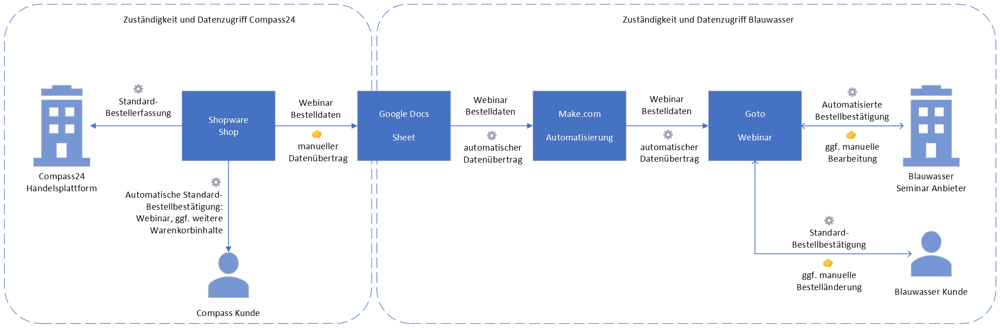

# GotoWebinarGoogleSheetsExport Plugin

**Version:** 1.1.0  
**Shopware Version:** 6.5.0+  
**Status:** ✅ Complete - Backend & Admin UI Fully Implemented  
**Complexity:** Intermediate to Advanced

---

## Schema and Demo

Here is a [demo video](../../../documentation/assets/extension--export-category-items-to-google-sheet/Shopware-to-Google-Category-Export--%202026-01-14.mov).


And the originally [planned schema (Visio)](../../../documentation/assets/extension--export-category-items-to-google-sheet/Compass-Blauwasser-Weninar-Registrierung.vsdx):



## Overview

This Shopware 6 plugin automatically exports order data to Google Sheets when customers purchase products from a configurable category (default: "GotoWebinar"). The plugin supports both scheduled automatic exports and manual on-demand exports.

> **⚠️ Note for Junior Developers:**  
> This is a **full-stack Shopware 6 plugin** that demonstrates both backend and frontend development:
> - Custom entity definitions and database migrations
> - Event subscribers and scheduled tasks
> - Third-party API integration (Google Sheets OAuth2)
> - Dependency injection and service architecture
> - Data abstraction layer (DAL)
> - CLI commands and admin API controllers
> - Vue.js admin components with Shopware Admin SDK
>
> **Development effort (all features implemented):**
> - **Backend (v1.0):**
>   - Experienced Developer: 3-5 days
>   - Junior Developer (learning Shopware): 1-2 weeks
>   - Complexity: Intermediate to Advanced
>
> - **Admin UI (v1.1):**
>   - Experienced Developer (knows Vue.js): 1-2 weeks
>   - Junior Developer (learning Vue.js + Shopware Admin SDK): 2-3 weeks
>   - Complexity: Intermediate
>
> **Total Project:** This touches nearly all aspects of Shopware plugin development (backend + frontend) and serves as an excellent reference implementation for learning. All features are now complete and production-ready.

## Features

### ✅ Implemented & Working (v1.1.0 - Complete)

**Backend Features:**
- ✅ **Automatic Export** - Scheduled exports at configurable intervals (15 minutes to weekly)
- ✅ **Manual Export** - On-demand export via CLI command and admin UI
- ✅ **Category-Based Filtering** - Export only orders containing products from specific category
- ✅ **OAuth2 Authentication** - Secure Google account integration with token refresh
- ✅ **Multi-Product Support** - Each product exported as separate row
- ✅ **Export Tracking** - Local database tracks all exports with status
- ✅ **CSV Export** - Download via API endpoint or admin dashboard
- ✅ **Error Handling** - Comprehensive logging and error tracking
- ✅ **Admin Configuration** - Full settings form in Shopware Admin
- ✅ **API Endpoints** - OAuth, manual export, statistics, CSV download

**Admin UI Features (v1.1.0):**
- ✅ **Admin Dashboard** - Interactive dashboard with visual statistics
- ✅ **Statistics Cards** - Total exports, pending count, last export timestamp
- ✅ **One-Click Export** - Manual export button with batch configuration
- ✅ **OAuth UI Flow** - Browser-based Google authorization with popup
- ✅ **Export Log Viewer** - Paginated table showing recent exports with status
- ✅ **CSV Download Button** - Direct download from admin interface
- ✅ **Real-Time Updates** - Automatic refresh after export operations
- ✅ **Multi-Language** - German and English translations included

## Exported Data Fields

For each product in an order that matches the configured category:
- Customer First Name
- Customer Last Name
- Order Number
- Product Number
- Sales Channel Name
- Customer Email

## Documentation

### 📋 [01_ARCHITECTURE_PLANNING.md](docs/01_ARCHITECTURE_PLANNING.md)
Complete technical blueprint for AI-driven development including:
- System architecture and components
- Database schema design
- Service layer structure
- API integration details
- Implementation phases
- Development guidelines

### 📖 [02_USER_MANUAL.md](docs/02_USER_MANUAL.md)
End-user guide covering:
- Prerequisites and requirements
- Google Sheets setup instructions
- OAuth2 configuration walkthrough
- Plugin installation (CLI and admin methods)
- Configuration settings
- Daily usage and operations
- Troubleshooting common issues
- FAQ section

### 🔧 [03_TECHNICAL_DOCUMENTATION.md](docs/03_TECHNICAL_DOCUMENTATION.md)
Developer and technical administrator guide including:
- Detailed system architecture
- Data flow diagrams
- Technical decision rationale
- Security implementation
- Performance optimization
- Error handling strategies
- Testing approach
- Deployment procedures
- Extension guidelines

## Project Status

**Current Phase:** ✅ Complete & Production Ready  
**Status:** All planned features implemented and tested

### ✅ v1.0.0 - Backend Implementation (Complete)
- ✅ Requirements gathering and architecture design
- ✅ Database schema and migration
- ✅ Entity definitions (OrderExportEntity, Definition, Collection)
- ✅ Core service layer (4 services):
  - GoogleSheetsService (OAuth2 + API integration)
  - OrderExportService (export management)
  - CategoryFilterService (product filtering)
  - CsvExportService (CSV generation)
- ✅ Event subscriber (OrderPlacedSubscriber)
- ✅ Scheduled task system (ExportOrdersTask + Handler)
- ✅ CLI command (`gotowebinar:export-orders`)
- ✅ Admin API controller (OAuth, manual export, stats, CSV download)
- ✅ Configuration UI (XML-based admin form)
- ✅ Dependency injection setup
- ✅ Unit tests (PHPUnit)
- ✅ Comprehensive documentation (8 guides, 12,000+ lines)

### ✅ v1.1.0 - Admin UI Implementation (Complete - January 7, 2026)
- ✅ Admin module registration with Shopware
- ✅ Dashboard page component (Vue.js)
- ✅ Statistics card showing metrics
- ✅ Manual export button with modal confirmation
- ✅ OAuth authorization button with popup flow
- ✅ Export log viewer with pagination (25 per page)
- ✅ CSV download functionality in UI
- ✅ Real-time status updates and notifications
- ✅ Multi-language support (German/English)
- ✅ Responsive design with Shopware admin components
- ✅ **Total: 17 Vue.js files implemented**

### 🚀 Production Ready
The plugin is **fully featured and production-ready**:
- ✅ Automatic exports on order payment
- ✅ Scheduled exports via cron
- ✅ Manual exports via CLI or admin dashboard
- ✅ Interactive admin dashboard with all features
- ✅ Browser-based OAuth setup
- ✅ Export monitoring and CSV downloads
- ✅ Comprehensive error handling and logging

**Access Points:**
1. **Admin Dashboard:** Settings → Plugins → Webinar Export (main interface)
2. **Configuration:** Settings → System → Plugins → Configure
3. **CLI Commands:** 
   - `bin/console gotowebinar:export-orders` - Manual export
   - `bin/console gotowebinar:scan-orders` - Scan existing orders
   - `bin/console gotowebinar:reset-exports` - Reset export logs (dev/testing)
4. **API Endpoints:** Full REST API for automation

## Quick Start

### Installation

1. **Review Documentation**
   - Read [04_INSTALLATION_GUIDE.md](docs/04_INSTALLATION_GUIDE.md) for detailed setup
   - Read [02_USER_MANUAL.md](docs/02_USER_MANUAL.md) for usage instructions

2. **Install Plugin**
   ```bash
   cd /path/to/shopware
   
   # Install dependencies
   cd custom/plugins/GotoWebinarGoogleSheetsExport
   composer install --no-dev
   
   # Install and activate plugin
   cd ../../..
   bin/console plugin:refresh
   bin/console plugin:install --activate GotoWebinarGoogleSheetsExport
   bin/console cache:clear
   ```

3. **Build Admin Assets**
   ```bash
   # Required for admin dashboard to appear
   bin/build-administration.sh
   ```

4. **Configure Google OAuth**
   - Follow Google Cloud setup in Installation Guide
   - Go to Settings → System → Plugins → Configure
   - Enter OAuth credentials
   - Click "Connect to Google" in the dashboard

5. **Start Using**
   - **Admin Dashboard:** Settings → Plugins → Webinar Export
   - **Manual Export:** Click "Export Now" button in dashboard
   - **Automated:** Enable scheduled exports in configuration

### Development

**Run Tests:**
```bash
cd custom/plugins/GotoWebinarGoogleSheetsExport
vendor/bin/phpunit
```

**Review Architecture:**
- [01_ARCHITECTURE_PLANNING.md](docs/01_ARCHITECTURE_PLANNING.md) - Complete system architecture
- [03_TECHNICAL_DOCUMENTATION.md](docs/03_TECHNICAL_DOCUMENTATION.md) - Technical deep dive

## System Requirements

### Shopware
- Shopware 6.5.0 or higher
- PHP 8.1 or higher
- MySQL 5.7+ or MariaDB 10.3+
- Composer

### External Services
- Google Cloud Platform account
- Google Sheets API enabled
- OAuth2 credentials configured

### Server
- HTTPS enabled (required for OAuth)
- Scheduled tasks (cron) configured
- Internet connectivity for Google API

## Installation Overview

Detailed installation instructions are in [02_USER_MANUAL.md](docs/02_USER_MANUAL.md).

**Quick Install (CLI):**
```bash
# Install dependencies
composer require google/apiclient

# Refresh and install plugin
bin/console plugin:refresh
bin/console plugin:install --activate GotoWebinarGoogleSheetsExport

# Clear cache
bin/console cache:clear
```

## Configuration

All configuration is managed via Shopware Administration:
- **Settings → System → Plugins → GotoWebinarGoogleSheetsExport**

Key settings:
- Enable/disable plugin
- Select category to monitor
- Google Sheets credentials (OAuth2)
- Export schedule interval
- Advanced options (batch size, duplicate handling)

## Support & Maintenance

### Logging
All export activities and errors are logged to:
- `var/log/prod.log` (production)
- `var/log/dev.log` (development)

### Monitoring
Monitor export health via:
- Admin dashboard statistics
- Database queries (see Technical Documentation)
- System logs

### Backup
Regular backups recommended for:
- `gotowebinar_order_export` table
- Plugin configuration in `system_config` table
- Google Sheets (use Google's version history)

## Security

- ✅ OAuth2 secure authentication (no passwords stored)
- ✅ Encrypted storage of refresh tokens
- ✅ HTTPS enforced for all Google API calls
- ✅ Data sanitization to prevent injection attacks
- ✅ Admin-only access to configuration
- ✅ No sensitive data in logs

## Performance

- ⚡ Asynchronous export (doesn't block order placement)
- ⚡ Batch processing (50 rows per API call)
- ⚡ Database indexing for fast queries
- ⚡ Token caching to reduce API calls
- ⚡ Configurable batch size and intervals

## License

MIT License (or specify your license)

## Author

Oliver Schafeld / GotoWebinar Integration

## Contributing

This plugin is designed for AI-driven development. When implementing:
1. Follow all guidelines in [01_ARCHITECTURE_PLANNING.md](docs/01_ARCHITECTURE_PLANNING.md)
2. Maintain code style consistency (PSR-12)
3. Add tests for all new functionality
4. Update documentation as needed

## Changelog

### Version 1.1.1 (January 16, 2026) - Bug Fix & Developer Tools
- 🐛 Fixed category filtering bug: Only products from the configured category are now exported (previously all products in an order were exported if any matched)
- 🐛 Fixed CategoryFilterService `in_array()` TypeError with category path handling
- ✅ New CLI command `gotowebinar:reset-exports` for clearing export logs during development/testing
  - Support for `--status` filter (pending, success, failed)
  - Support for `--force` to skip confirmation
  - Batched deletion for large datasets

### Version 1.1.0 (January 7, 2026) - Admin UI Release ✨
- ✅ Complete admin dashboard with Vue.js components
- ✅ Visual statistics cards (total, pending, last export)
- ✅ One-click manual export with batch configuration
- ✅ Browser-based OAuth flow with popup window
- ✅ Paginated export log viewer (25 entries per page)
- ✅ CSV download button in admin interface
- ✅ Real-time notifications and status updates
- ✅ German and English translations
- ✅ 17 Vue.js components and templates

### Version 1.0.0 (December 22, 2025) - Backend Release
- ✅ Initial release with complete backend
- ✅ Order export to Google Sheets
- ✅ Scheduled and manual export modes (CLI)
- ✅ OAuth2 authentication with token refresh
- ✅ Category-based product filtering
- ✅ CSV export via API endpoint
- ✅ Comprehensive error handling and logging
- ✅ Admin configuration panel
- ✅ Database migration and entity system
- ✅ Unit tests and documentation

---

**✅ Production Ready** 🚀

All features implemented and documented. The plugin is ready for production deployment.
